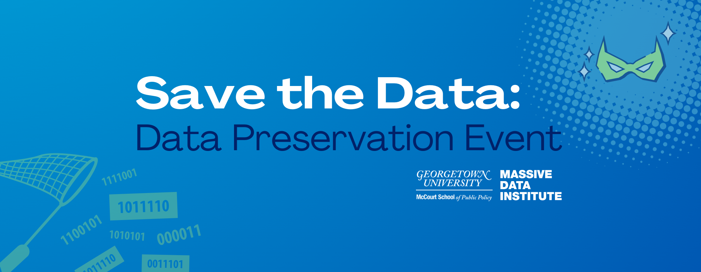

# Save The Data 

A fork of [UI-Research/data-preservation-public](https://github.com/UI-Research/data-preservation-public)

## Partnering Organizations (alphabetical order)
(list as of February 12, 2025)

- [American Educational Research Association](https://www.aera.net/)
- [Georgetown University Ethics Lab](https://ethicslab.georgetown.edu/)
- [Georgetown University Department of Sociology](https://sociology.georgetown.edu/)
- [Georgetown University Department of Computer Science](https://cs.georgetown.edu/)
- [Georgetown University Library](https://library.georgetown.edu/)
- [Massive Data Institute](https://library.georgetown.edu/scholarly-communication)
- [University of Michigan Institute for Social Research](https://isr.umich.edu/)
- [Urban Institute](https://www.urban.org/)

## Technical Guidance

[Follow Urban Institute's README](README_UI.md)